# Manual de Usuario - Sistema de Archivos EXT2 Simulado

+ Autor: José Emanuel Monzón Lémus
+ Carnet: 202300539
+ Curso: Manejo e implementación de archivos B 
+ Repositorio: https://github.com/0520Jose/MIA_2S2025_P2_202300539.git

---

## Introducción

**ExtreamFS** es un sistema de administración de discos virtuales que permite crear, gestionar y manipular discos, particiones y sistemas de archivos de manera gráfica e interactiva. El sistema está desarrollado con tecnología web (React + Go) y proporciona una interfaz intuitiva para realizar operaciones complejas de administración de almacenamiento.

### Características Principales
- ✅ Creación y gestión de discos virtuales
- ✅ Particionado de discos (MBR)
- ✅ Formateo de particiones (EXT2)
- ✅ Sistema de usuarios y grupos
- ✅ Montaje y desmontaje de particiones
- ✅ Operaciones sobre archivos y directorios
- ✅ Generación de reportes gráficos
- ✅ Interfaz web
- ✅ Carga de archivos de comandos por lotes

---

## Requisitos del Sistema

### Requisitos Mínimos
- **Sistema Operativo:** Linux cualquier distribucion basada en ubuntu
- **RAM:** 4 GB mínimo, 8 GB recomendado
- **Espacio en disco:** 500 MB libres
- **Navegador web:** cualquier navegador
- **Resolución de pantalla:** 1366x768 mínimo

### Requisitos de Software
- **Go Runtime:** Versión 1.19 o superior
- **Node.js:** Versión 16.0 o superior
- **Puerto de red:** 8000 disponible para el servidor backend

---

## Instalación y Configuración

### Paso 1: Descargar el Sistema
1. Descargue el archivo comprimido del sistema desde: `https://github.com/0520Jose/MIA_2S2025_P2_202300539.git`
2. Extraiga el contenido en la carpeta deseada:`/opt/godisk` (Linux)

### Paso 2: Iniciar el Servidor Backend
**En Linux:**
```bash
cd /opt/godisk/backend
node main.go
```

### Paso 3: Acceder a la Interfaz Web
1. Abra su navegador web preferido
2. Navegue a: ``
3. La interfaz de GoDisk debería cargarse automáticamente

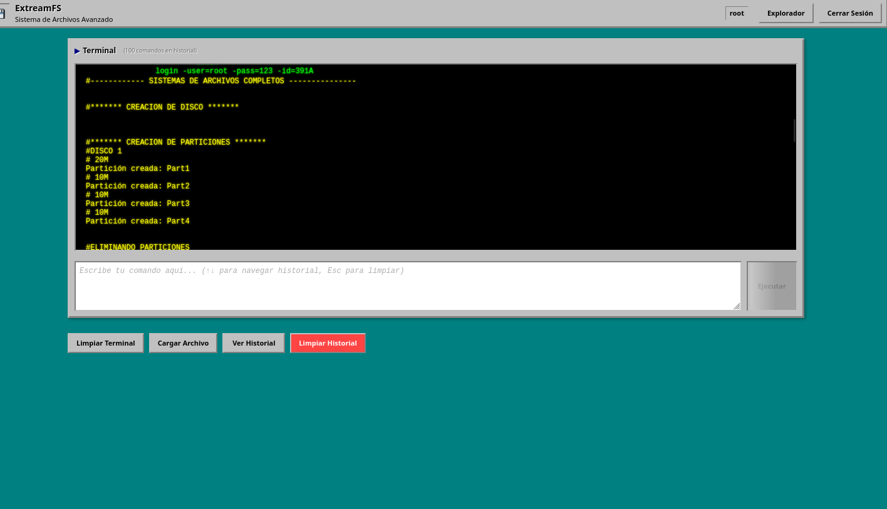

---

## Interfaz de Usuario

La interfaz de GoDisk se compone de los siguientes elementos:

### Barra de Herramientas Superior
- **Elegir archivo:** Permite cargar archivos de comandos (.smia)
- **Ejecutar:** Ejecuta los comandos escritos en el panel de entrada
- **Limpiar:** Limpia ambos paneles (entrada y salida)

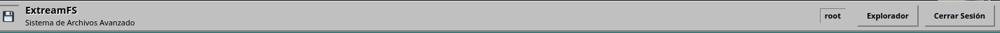

#### Al elegir un archivo se mostrar la siguiente ventana que le permitira seleccionar el scrip que sea necesario ejecutar.

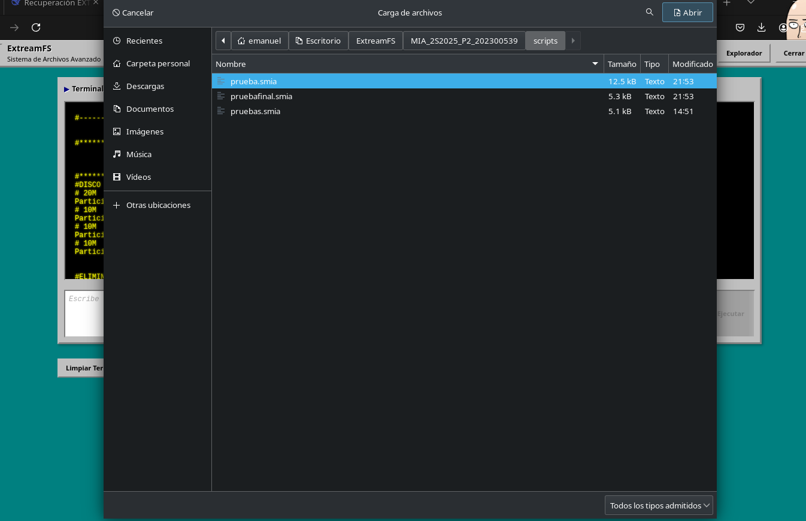

### Panel de Entrada
- **Ubicación:** Lado izquierdo de la pantalla
- **Propósito:** Escribir o pegar comandos a ejecutar
- **Funcionalidad:** 
  - Admite múltiples líneas de comandos
  - Ejecuta con Enter (sin Shift)
  - Sintaxis resaltada automática

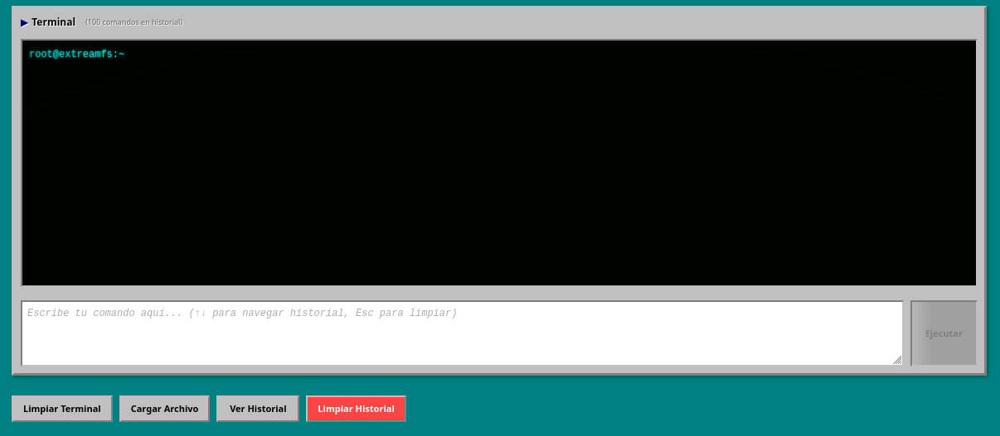

### Panel de Salida
- **Ubicación:** Lado derecho de la pantalla
- **Propósito:** Muestra los resultados de los comandos ejecutados
- **Características:**
  - Solo lectura
  - Mantiene historial de ejecuciones
  - Scroll automático para comandos largos

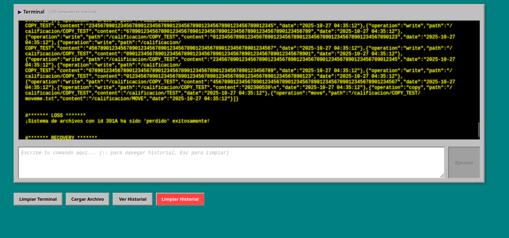

---

## Comandos Disponibles

### 1. Gestión de Discos

#### MKDISK - Crear Disco
```bash
mkdisk -size=<tamaño> -unit=<unidad> -path=<ruta>
```
**Parámetros:**
- `size`: Tamaño del disco (obligatorio)
- `unit`: Unidad de medida (M=Megabytes, K=Kilobytes)
- `path`: Ruta donde crear el archivo del disco

**Ejemplo:**
```bash
mkdisk -size=10 -unit=M -path=/home/emanuel/Disco1.mia
```

#### RMDISK - Eliminar Disco
```bash
rmdisk -path=<ruta>
```

### 2. Gestión de Particiones

#### FDISK - Gestionar Particiones
```bash
fdisk -size=<tamaño> -path=<ruta> -name=<nombre> -unit=<unidad> -type=<tipo> -fit=<ajuste>
```
**Parámetros:**
- `size`: Tamaño de la partición
- `path`: Ruta del disco
- `name`: Nombre de la partición
- `unit`: Unidad (M, K)
- `type`: Tipo (P=Primaria, E=Extendida, L=Lógica)
- `fit`: Algoritmo de ajuste (BF, FF, WF)

**Ejemplo:**
```bash
fdisk -size=5 -path=/home/emanuel/Disco1.mia -name=Particion1 -unit=M -type=P -fit=BF
```

### 3. Sistema de Archivos

#### MKFS - Formatear Partición
```bash
mkfs -id=<id_particion> -type=<tipo_fs>
```
**Ejemplo:**
```bash
mkfs -id=39A1 -type=ext2
```

#### MOUNT - Montar Partición
```bash
mount -path=<ruta> -name=<nombre>
```

#### MKDIR - Crear Directorio
```bash
mkdir -path=<ruta> -name=<nombre> -id=<id_particion>
```

#### MKFILE - Crear Archivo
```bash
mkfile -path=<ruta> -size=<tamaño> -id=<id_particion>
```

### 4. Gestión de Usuarios

#### LOGIN - Iniciar Sesión
```bash
login -user=<usuario> -pass=<contraseña> -id=<id_particion>
```

#### LOGOUT - Cerrar Sesión
```bash
logout
```

#### MKUSR - Crear Usuario
```bash
mkusr -user=<usuario> -pass=<contraseña> -grp=<grupo> -id=<id_particion>
```

#### MKGRP - Crear Grupo
```bash
mkgrp -name=<nombre_grupo> -id=<id_particion>
```

### 5. Utilidades

#### CAT - Mostrar Contenido de Archivo
```bash
cat -file=<ruta_archivo> -id=<id_particion>
```

#### REP - Generar Reportes
```bash
rep -name=<tipo_reporte> -path=<ruta_salida> -id=<id_particion>
```

#### MOUNTED - Listar Particiones Montadas
```bash
mounted
```

### 7. Login

```bash
login -user=<usuario> -pass=<contraseña> -id=<id_particion>
```

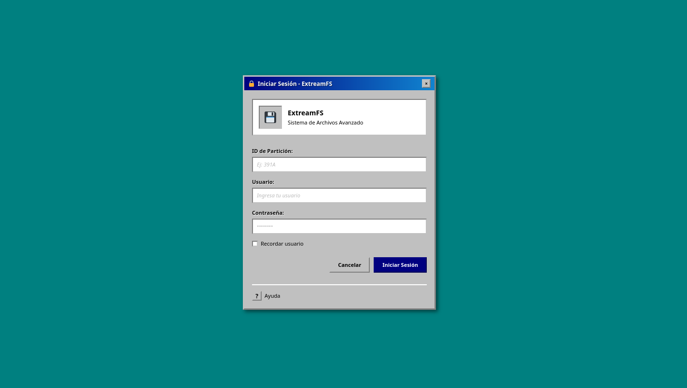

### 6. Explorador de archivos

#### Explorador de Archivos
Permite visualizar y navegar en los discos y particiones montadas, mostrando la estructura de directorios y archivos.

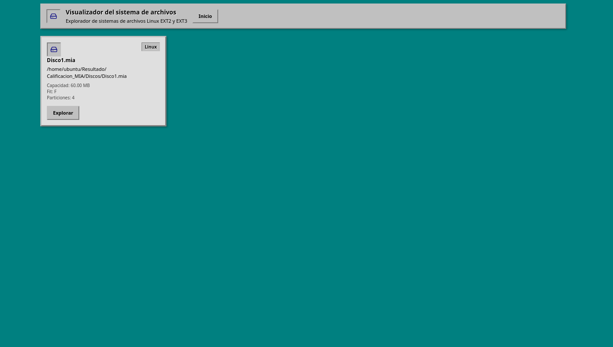

Permite visualizar las particiones del disco actual, las carpetas dentro de la partición montada y el contenido de los archivos seleccionados.

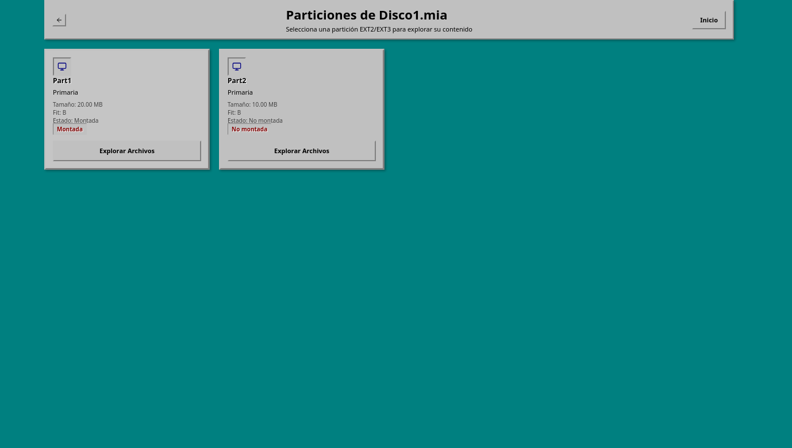

Se pude navegar entre las carpetas haciendo doble clic en ellas y ver el contenido de los archivos seleccionándolos una vez.

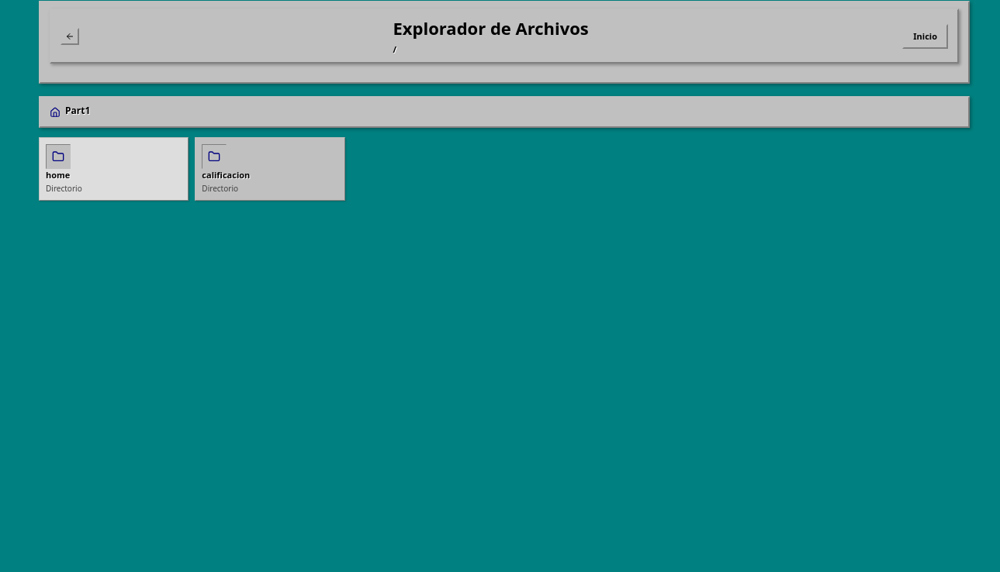

Al seleccionar un archivo, su contenido se muestra en el panel derecho.

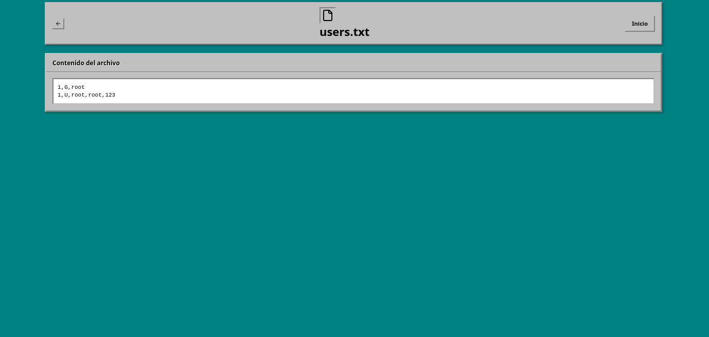

---

## Guía de Uso Paso a Paso

### Escenario 1: Configuración Inicial del Sistema

#### Paso 1: Crear un Disco Virtual
1. En el panel de entrada, escriba:
   ```bash
   mkdisk -size=50 -unit=M -path=/home/emanuel/MiDisco.mia
   ```
2. Presione Enter o haga clic en "Ejecutar"
3. Verifique en el panel de salida que el disco se creó exitosamente

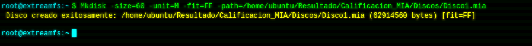

#### Paso 2: Crear Particiones
1. Crear partición primaria:
   ```bash
   fdisk -size=20 -path=/home/emanuel/MiDisco.mia -name=Primaria1 -unit=M -type=P -fit=BF
   ```
2. Crear partición extendida:
   ```bash
   fdisk -size=25 -path=/home/emanuel/MiDisco.mia -name=Extendida1 -unit=M -type=E -fit=BF
   ```
3. Crear partición lógica dentro de la extendida:
   ```bash
   fdisk -size=10 -path=/home/emanuel/MiDisco.mia -name=Logica1 -unit=M -type=L -fit=BF
   ```

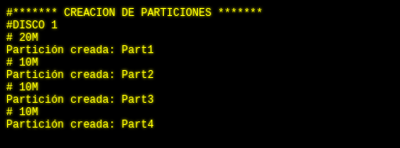

#### Paso 3: Formatear Particiones
1. Formatear partición primaria:
   ```bash
   mkfs -id=39A1 -type=ext2
   ```
2. Formatear partición lógica:
   ```bash
   mkfs -id=A5 -type=ext2
   ```

### Escenario 2: Gestión de Archivos y Usuarios

#### Paso 1: Montar Partición
```bash
mount -path=/home/emanuel/MiDisco.mia -name=Primaria1
```

#### Paso 2: Iniciar Sesión como Root
```bash
login -user=root -pass=123 -id=39A1
```

#### Paso 3: Crear Grupos y Usuarios
1. Crear grupo:
   ```bash
   mkgrp -name=usuarios -id=39A1
   ```
2. Crear usuario:
   ```bash
   mkusr -user=emanuel -pass=12345 -grp=usuarios -id=39A1
   ```

#### Paso 4: Crear Estructura de Directorios
```bash
mkdir -path=/home -name=emanuel -id=39A1
mkdir -path=/home/emanuel -name=documentos -id=39A1
```

#### Paso 5: Crear Archivos
```bash
mkfile -path=/home/emanuel/archivo.txt -size=100 -id=39A1
```

---

## Ejemplos

### Ejemplo 1: Script
Guarde el siguiente contenido en un archivo `inicio.txt`:

```bash
# Crear disco de 20 MB
mkdisk -size=20 -unit=M -path="/home/emanuel/Disco3.mia"

# Crear primera partición primaria de 3 MB
fdisk -size=3 -unit=M -type=P -path="/home/emanuel/Disco3.mia" -name=Primaria1

# Montar una partición para probar el resto del sistema
mount -path="/home/emanuel/Disco3.mia" -name=Primaria1

# Formatear partición montada (usa el ID que te devuelva mount)
mkfs -id=391A

# Iniciar sesión
login -user=root -pass=123 -id=391A

# Crear grupo de desarrolladores (máximo 10 caracteres)
mkgrp -name=devs -id=391A

# Crear usuario tester
mkusr -user=tester -pass=test123 -grp=testers -id=391A


# Crear carpeta personal de usuario
mkdir -path="/home" -id=391A
mkdir -path="/home/admin" -id=391A
mkdir -path="/home/admin/docs" -id=391A
mkdir -path="/home/admin/down" -id=391A
mkfile -path="/home/admin/perfil.txt" -size=100 -id=391A
mkfile -path="/home/admin/docs/notas.txt" -size=250 -id=391A

# Ver contenido del README (corregir parámetro)
cat -file="/proyecto/README.md" -id=391A

# Ver contenido de archivos de configuración
cat -file="/proyecto/config/config.json" -id=391A
cat -file="/proyecto/config/db.conf" -id=391A

# Ver contenido de archivos de código
cat -file="/proyecto/src/main.go" -id=391A
cat -file="/proyecto/src/comp/auth.go" -id=391A

# Ver logs
cat -file="/data/app.log" -id=391A
cat -file="/data/error.log" -id=391A

# Ver archivos de usuario
cat -file="/home/admin/perfil.txt" -id=391A
cat -file="/home/admin/docs/notas.txt" -id=391A

# Cerrar sesión
logout

# Reporte del MBR - aquí deberías ver los 3 tipos de particiones
rep -id=391A -path="/home/emanuel/reportes3/mbr_completo.png" -name=mbr

# Reporte del disco
rep -id=391A -path="/home/emanuel/reportes3/disk_completo.png" -name=disk

```

**Cómo usar este script:**
1. Copie el contenido a un archivo de texto
2. Haga clic en "Elegir archivo" y seleccione su archivo
3. Haga clic en "Ejecutar"
4. Observe los resultados en el panel de salida


### Ejemplo 2: Gestión de Archivos
```bash
# Iniciar sesión como usuario específico
login -user=admin -pass=admin123 -id=39A1

# Crear archivos de configuración
mkfile -path=/var/config.txt -size=50 -id=39A1
mkfile -path=/home/readme.txt -size=100 -id=39A1

# Ver contenido de archivos
cat -file=/users.txt -id=39A1

# Generar reporte del sistema
rep -name=disk -path=/tmp/reporte_disco.dot -id=39A1
```

---

## Resolución de Problemas

#### Error: "Comando no reconocido"
**Síntomas:** El sistema responde "Comando no reconocido" al ejecutar un comando.

**Posibles Causas:**
- Comando mal escrito
- Sintaxis incorrecta
- Comando no implementado

**Solución:**
1. Verifique la sintaxis del comando
2. Consulte la lista de comandos disponibles en la sección correspondiente
3. Asegúrese de usar la sintaxis correcta: `comando -parametro=valor`

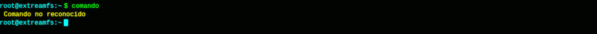

#### Error: "Partición no montada"
**Síntomas:** Al ejecutar comandos de archivos aparece "partición no montada".

**Solución:**
1. Verifique las particiones montadas con: `mounted`
2. Monte la partición necesaria: `mount -path=<ruta_disco> -name=<nombre_particion>`
3. Verifique que el ID de partición sea correcto

#### Error: "No hay usuario logueado"
**Síntomas:** Comandos de archivos fallan con mensaje de usuario no logueado.

**Solución:**
1. Inicie sesión primero: `login -user=root -pass=123 -id=<id_particion>`
2. Verifique credenciales correctas
3. Asegúrese de que la partición esté montada

#### Error: "Archivo no encontrado"
**Síntomas:** El comando `cat` no encuentra el archivo especificado.

**Solución:**
1. Verifique que la ruta del archivo sea correcta
2. Asegúrese de que el archivo existe
3. Verifique permisos de acceso

### Mensajes de Error Específicos

| Error | Significado | Solución |
|-------|-------------|----------|
| "Error parámetros" | Parámetros faltantes o incorrectos | Revisar sintaxis del comando |
| "Ya existe un disco en esa ruta" | El archivo del disco ya existe | Usar otra ruta o eliminar el archivo existente |
| "Partición fuera de límites" | No hay espacio suficiente | Reducir tamaño o reorganizar particiones |
| "Usuario o contraseña incorrectos" | Credenciales inválidas | Verificar usuario y contraseña |

---

## Información de Contacto y Soporte

### Datos del Proyecto
- **Nombre del Sistema:** ExtreamFS
- **Versión:** 1.0
- **Desarrollador:** José Emanuel Monzón Lémus
- **Fecha de Lanzamiento:** 07/082025
